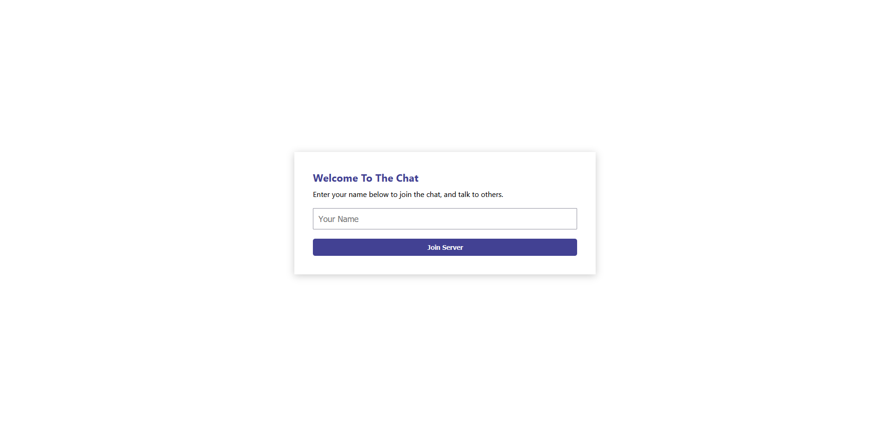
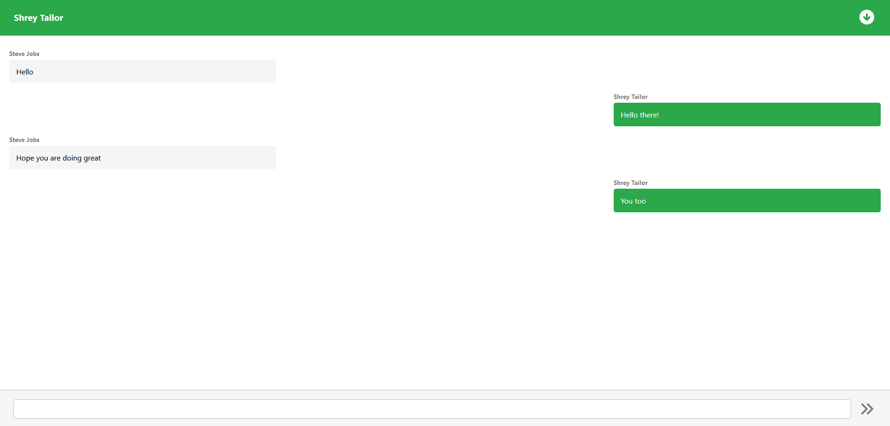
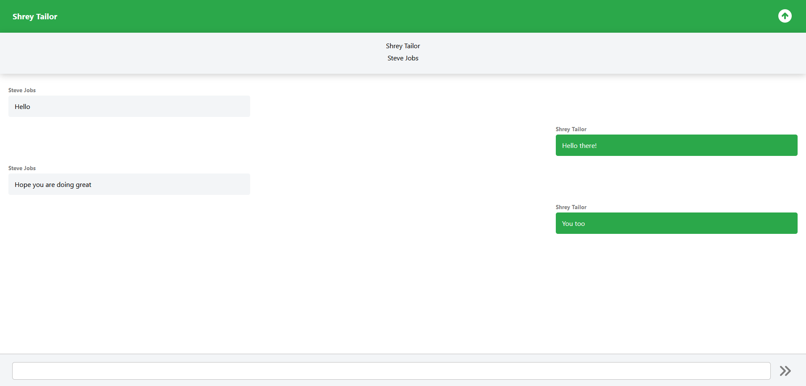

# Socket Chat

## Contents
- [Project Description](#project-description)
- [Usage Instructions](#usage-instructions)
- [Screenshots](#screenshots)

## Project Description

This is a real-time chatting application, which uses React for the user interface, and a `Socket.io` server for the backend. When a new client joins the server, it tries to establish a persistent bidirectional pipeline with the backend. If successful, both the client and server store the created sockets to use them later in the communication.

## Usage Instructions

1. Run `npm install` in the `frontend` and `socket-server` directories.

2. Create an `.env` file in the `socket-server` directory which contains a port number you would like to use, to start the backend server on your host. An example is shown below.

```
PORT=8080
```

3. Create an `.env` file in the `frontend` directory, which contains your backend server's connection string. If you are running this backend server locally on your home network, it would be the local IP address of your host. An example is shown below.

```
REACT_APP_SOCKET_SERVER=http://192.168.1.84:8080
```

4. Run `node index.js` in the `socket-server` directory.

5. Run `npm run start` in the `frontend` directory.

## Screenshots





